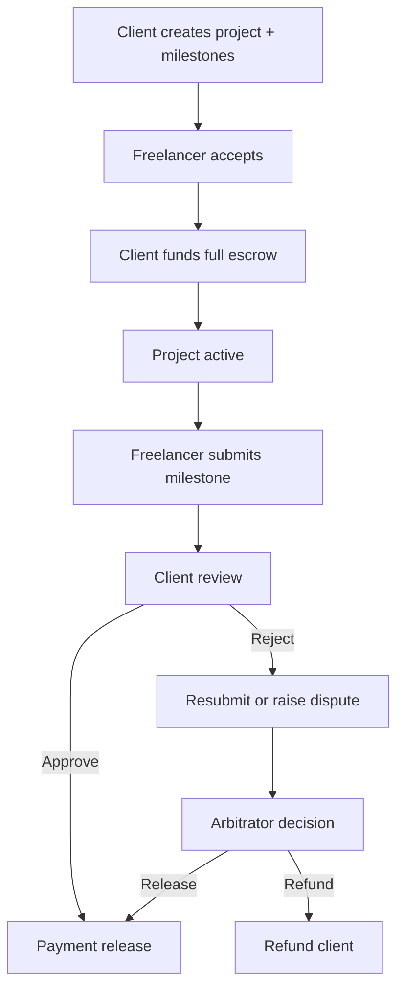

# Frontend Page & User Flow v1

## 1. Pages

| Page | Purpose |
|---|---|
| Dashboard | Role-specific metrics, task focus, activity overview, meaningful status chart |
| Projects | Project list and status overview |
| Project detail | Milestones, funding/submission/review actions, escrow state |
| Create project | Client project + milestone creation form |
| Transactions | Financial and workflow transaction history |
| Event logs | Smart-contract event timeline |
| Disputes | Open/previous disputes and arbitrator decisions |

## 2. Role → Page Mapping

| Role | Accessible pages | Main emphasis |
|---|---|---|
| Client | All, including Create project | Create, fund, review, approve/reject |
| Freelancer | Dashboard, Projects, detail, Transactions, Event logs, Disputes | Accept, submit/resubmit, verify funding, dispute |
| Arbitrator | Dashboard, Projects/detail read view, Transactions, Event logs, Disputes | Review evidence and make binary resolution |

> Current navigation keeps shared audit pages visible for demo transparency. Backend/contract role checks must remain the source of authorization.

## 3. Role → Action Mapping

| Role | Actions in UI |
|---|---|
| Client | Create project/milestones, fund full escrow, approve/release, reject with reason, raise dispute |
| Freelancer | Accept assigned project, submit/resubmit milestone, view escrow funding, raise dispute |
| Arbitrator | View open dispute and related record, release to Freelancer or refund Client |

## 4. Core User Flows

## 5. Dashboard Information

| Role | Metrics / visualisation |
|---|---|
| Client | Projects created, active/completed projects, escrowed total, released total, milestones awaiting review, disputes; milestone-status, funds-by-status, and outcome charts |
| Freelancer | Assigned/active/completed projects, earnings, pending client review, disputes; milestone-status, funds-by-status, and workload charts |
| Arbitrator | Open/resolved cases, value under review, linked projects, recent decisions; dispute-status, escrow-value, and decision charts |

## 6. Blockchain-related UI

| UI location | Future blockchain requirement | Current status |
|---|---|---|
| Header | MetaMask connection, account/network change detection | Implemented; network is configurable |
| Project detail: funding | Client signature, tx hash/status, `ProjectFunded` event | Mock transaction state only |
| Project detail: accept / approve/release | Signatures, tx hash/status, acceptance/payment events | Mock/placeholder only |
| Dispute resolution | Arbitrator signature, tx hash/status, resolution event | Mock/placeholder only |
| Transactions / Events | Real tx hashes/status and events | Mock Adapter |

## 7. Backend Data Requirements

All endpoints below are **Frontend Expected API / Placeholder**, not confirmed Backend API.

| Page / feature | Needed data | Needed action | Expected API placeholder | Current status |
|---|---|---|---|---|
| Dashboards | role metrics, project/milestone statuses | retrieve | `GET /dashboard?role=` | Mock |
| Projects | project and milestone records | list/read/create | `GET/POST /projects`, `GET /projects/:id` | Mock |
| Submission/rejection | submission note/file reference, rejection reason | update workflow data | `POST /milestones/:id/submission`, `POST /milestones/:id/rejection` | Mock |
| Disputes | dispute, description, outcome | create/list/resolve | `GET/POST /disputes`, `POST /disputes/:id/resolve` | Mock |
| Transactions/events | user-visible audit records | list/filter | `GET /transactions`, `GET /events` | Mock |
